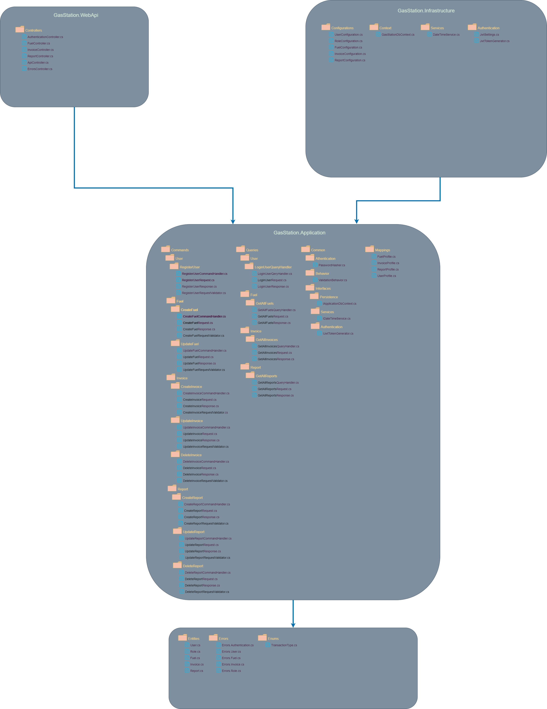
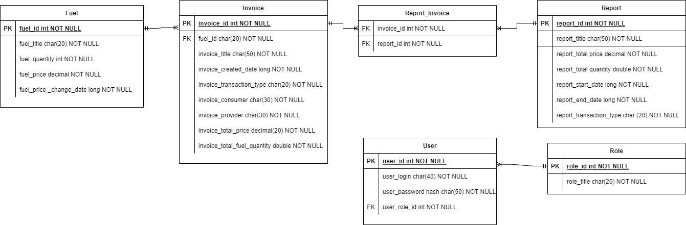
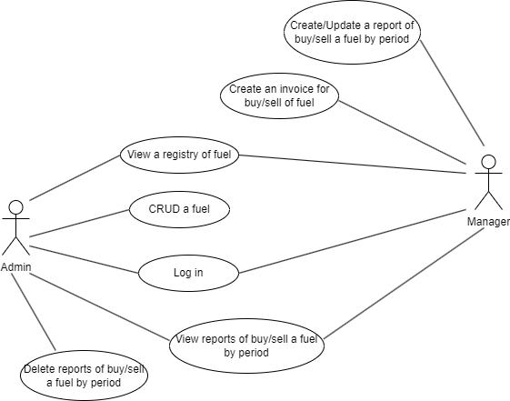

# GasStation Diagrams

## GasStation-DDD diagram

This section describes a diagram that depicts the different layers of a GasStation's DDD
(Domain-Driven Design) architecture. The diagram showcases the four main layers, which are
 Domain, Application, Infrastructure and Presentation. The Presentation layer being
 specifically implemented using .Net Core Web API.

The follow diagram provides a high-level overview of the GasStation's DDD architecture and its different layers:

> Note: The diagram located at the bottom is open to changes as we move forward in the development process.

## GasStation-ER diagram

Below is an ER diagram for GasStation, which illustrates the relationships between different entities in the database.

> Note: The diagram located at the bottom is open to changes as we move forward in the development process.

## GasStation-UseCase diagram

In the diagram presented below, you can see a visual representation of the users of the GasStation system and how they interact with the system.

> Note: The diagram located at the bottom is open to changes as we move forward in the development process.

